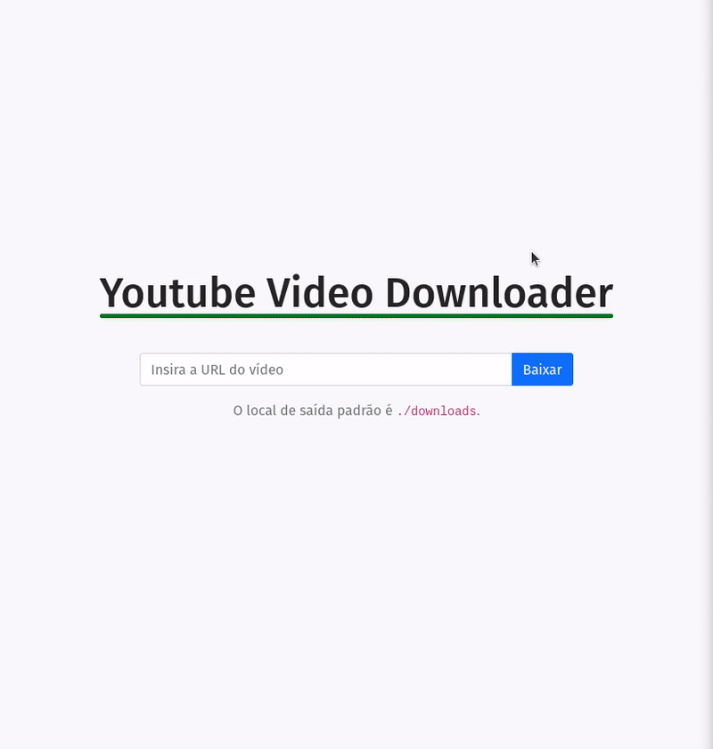

# Flask Youtube Video Downloader



Este é um projeto simples desenvolvido com Flask, que fornece uma interface amigável para a biblioteca [yt-dlp](https://github.com/yt-dlp/yt-dlp), facilitando o download de vídeos do YouTube e outras plataformas. Os vídeos baixados são salvos na pasta `./downloads`.

## Pré-requisitos

Antes de começar, certifique-se de ter o seguinte instalado:

- **Python 3.10+**
- **pip**
- **Docker** (opcional, caso utilize o Docker Compose)

## Instalação e Execução

Você pode rodar o projeto de duas formas: localmente usando um ambiente virtual ou com Docker Compose.

### 1. Executando Localmente

1. Clone este repositório:

```bash
   git clone https://github.com/Moscarde/flask_youtube_downloader.git
   cd flask-youtube-downloader
```

2. Crie um ambiente virtual e ative-o:
```bash
    python3 -m venv env
    source env/bin/activate  # No Windows: env\Scripts\activate
```

3. Instale as dependências:

```bash
    pip install -r requirements.txt
```

4. Inicie o servidor:

```bash
    python run.py
```

5. Acesse o aplicativo no navegador em http://localhost:5000.

### 2. Executando com Docker Compose

1. Certifique-se de que o Docker e o Docker Compose estão instalados no seu sistema.

2. Clone este repositório:
```bash
   git clone https://github.com/Moscarde/flask_youtube_downloader.git
   cd flask-youtube-downloader
```

3. Construa e inicie os serviços:
```
    docker compose up --build
```

4. Acesse o aplicativo no navegador em http://localhost:5000.   

## Funcionalidades

- **Adicionar URL do Vídeo**: Insira o link do vídeo e clique em "Baixar".
- **Download Automático**: O vídeo será baixado automaticamente para a pasta `./downloads`.
- **Interface Amigável**: Interface simples e responsiva para facilitar o uso.

## Tecnologias Utilizadas

- **Flask**: Framework web Python.
- **yt-dlp**: Biblioteca para download de vídeos.
- **HTML, CSS e JavaScript**: Para o front-end.
- **Docker**: Para empacotamento e execução do projeto.

